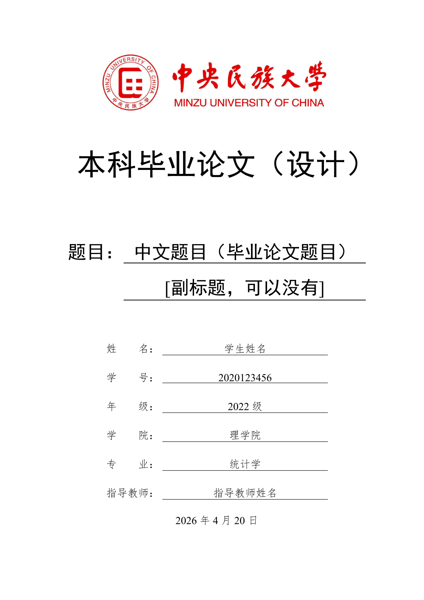
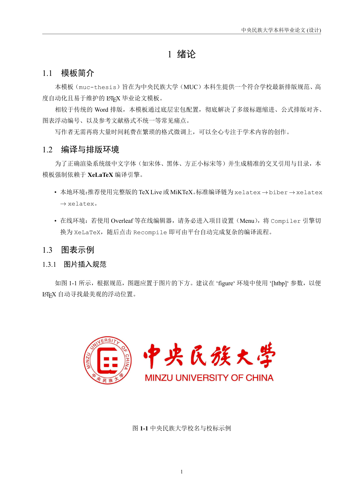
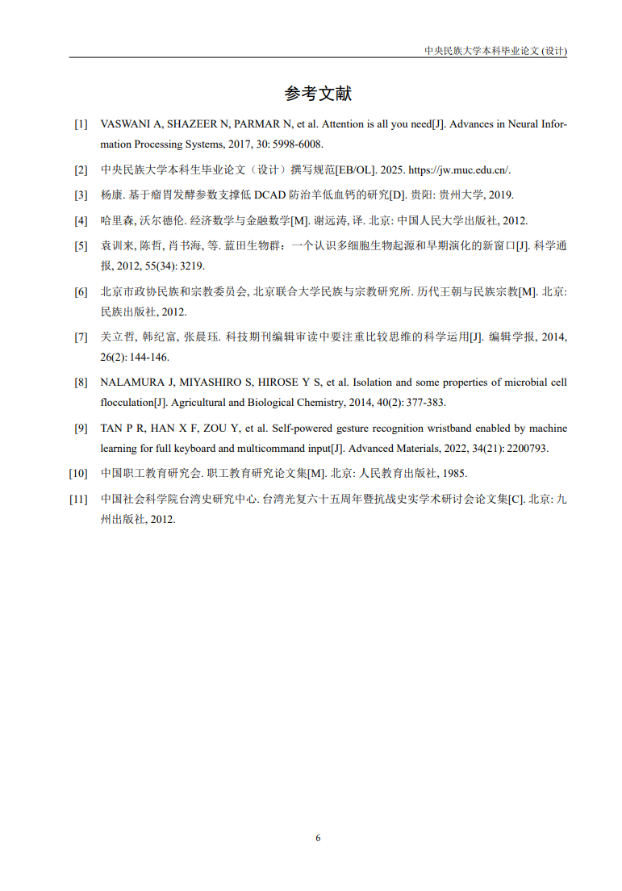
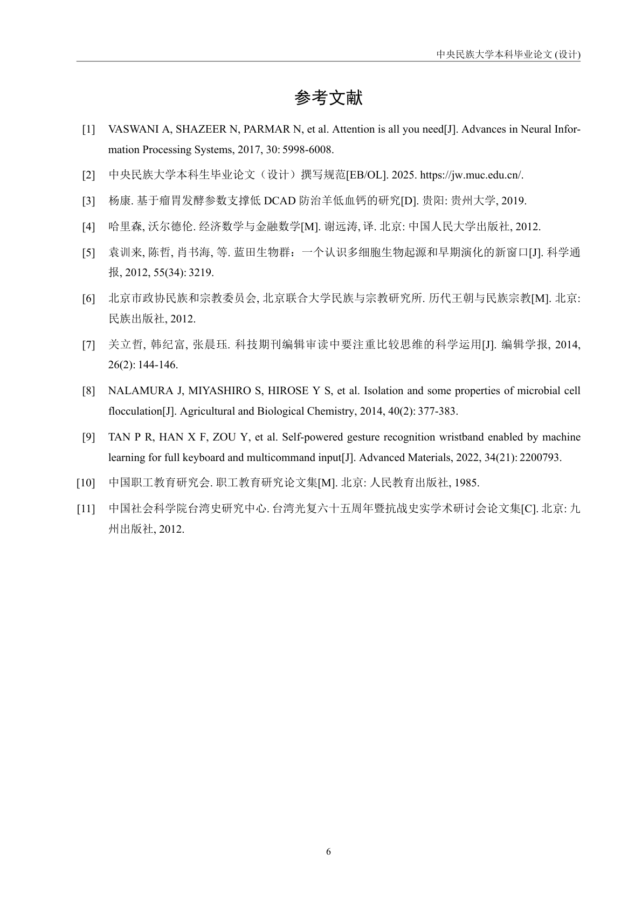

# 中央民族大学本科毕业论文 $\LaTeX$ 模板 

一个符合中央民族大学学校规范、专业且易用的 LaTeX 本科生毕业论文模板。
 
<p align="center">
  
  
  
  
</p>

模板参考了 Word 版本的 [【毕业论文模板】-2025年11月理学院发布.doc](./docs/【毕业论文模板】-2025年11月理学院发布.doc)，适用于大部分学院通用要求。

---

### 如何使用

### Overleaf 编辑（在线）

本模板可以使用 [Overleaf](https://www.overleaf.com/) 在线编辑，需要在 [releases](https://github.com/KardeniaPoyu/muc-thesis/releases) 页面提前下载 `Source code (zip)`。

步骤如下：

1. 进入 [Overleaf](https://www.overleaf.com/) 并登录账号
2. 左侧 `New Project` 选择 `Upload Project`
3. 上传 `.zip` 压缩包，建立新项目
4. 点击 `menu`，滑动到下方 `Settings` 的 `Compiler` 选择 `XeLaTeX`
5. 打开 `main.tex` 文件，点击中间右上方的 `Recompile` 进行编译
6. 如果顺利可以看到 pdf 的预览
7. 如果无法加载图片只有路径信息，点击 `Recompile` 旁边的倒三角，其中的 `Compile Mode` 选择 `Normal` 模式

此时可以得到完整的 `main.pdf` 文件。

* ⚠️ 由于 Overleaf 将免费账户的超时时间缩短到 20 秒，因此如果您在使用免费账户，可能无法成功完成项目的编译。[Overleaf 官方声明](https://www.google.com/search?q=https://www.overleaf.com/blog/compilation-timeout-standardization-on-overleaf)

### GitHub Actions 自动构建（在线）

点击 [Use this template](https://github.com/KardeniaPoyu/muc-thesis/generate) 创建自己的论文仓库（推荐创建为私有仓库），随后直接在自己的仓库进行修改，随后 GitHub Actions 会自动进行构建，可在 Actions 中下载对应 artifact。

还可以使用 `git tag`，其会像本仓库一样将构建好的 artifact 永久发布到 [releases](https://github.com/KardeniaPoyu/muc-thesis/releases) 中。

### Devcontainer 编辑（本地 & 在线）

> [!IMPORTANT]
> 无论是本地还是在线编辑，都需要首先创建自己的论文仓库，在自己的仓库进行修改，并建议及时 `commit & push` 到远程仓库进行备份。

本模板提供完整的 [VS Code Dev Containers](https://code.visualstudio.com/docs/remote/containers) 容器化配置。内部封装了最新版 TeX Live 环境，并自动安装 LaTeX Workshop 与中文语言包插件。无论是在本地使用 Docker 还是通过 GitHub Codespaces，均可实现免配环境、开箱即用。

* 对于在线编辑，可以使用 [GitHub Codespaces](https://github.com/features/codespaces) 通过浏览器版本的 VS Code 进行编辑。（请注意，GitHub Codespaces 每月免费额度有限，请注意用量）。
* 而对于本地编辑，需要安装 Docker 和 VS Code，并在 VS Code 中安装 [Remote - Containers](https://marketplace.visualstudio.com/items?itemName=ms-vscode-remote.remote-containers) 插件。随后打开本仓库，键入 `F1`，选择 `Remote-Containers: Reopen in Container` 即可构建进入容器环境。

在容器环境中，可以使用 `make`（或 `make help`）查看所有可用的编译子命令。例如，使用 `make main` 进行编译并生成 `main.pdf` 文件，或者使用 LaTeX Workshop 插件进行编译与预览。

### $\TeX$ 环境编辑（本地）

您需要安装 [TeX Live](https://www.tug.org/texlive/) (>= 2020) 或 [MiKTeX](https://miktex.org/) 环境。

**编译命令：**

按照以下顺序完整运行一遍编译链：

1.  **`xelatex main`** （生成辅助文件）
2.  **`biber main`** （处理参考文献数据）
3.  **`xelatex main`** （将文献写入正文）
4.  **`xelatex main`** （更新引用编号和目录）

建议使用编辑器自带的编译按钮，或在终端执行：

```bash
xelatex main
biber main
xelatex main
xelatex main
```

即可生成 `main.pdf` 文件。


---

## 项目结构说明


```text
muc-thesis/
├── main.tex                        # 论文主入口（控制个人信息与章节调度）
├── muc-thesis.cls                  # 模板类定义（格式核心，定义字体/字号/间距）
├── contents/                       # [核心] 论文正文内容存放目录
│   ├── abstract.tex                # 中英文摘要
│   ├── 01-introduction.tex         # 第一章：绪论与排版示例
│   ├── 02-references-usage.tex     # 第二章：参考文献使用教程
│   ├── 03-usage-guide.tex          # 第三章：模板使用指南（推荐阅读）
│   ├── 04-conclusion.tex           # 第四章：论文总结与展望
│   └── acknowledgements.tex        # 致谢
├── references.bib                  # 参考文献数据库（BibTeX 格式）
├── figures/                        # 图片资源存放目录（自动检索路径）
├── docs/                           # 存放参考规范和原始 Word 模板
```

## 快速上手


1. **修改个人信息**：打开 `main.tex`，在导言区修改 `\title`、`\author`、`\studentid` 等个人信息。
2. **撰写正文**：直接在 `contents/` 目录下对应的章节文件中编写文字。
3. **增加章节**：在 `contents/` 新建 `.tex` 文件，并在 `main.tex` 中通过 `\include{contents/文件名}` 引入。
4. **管理图片**：将所有图片放入 `figures/` 文件夹，正文中直接引用文件名即可。

## 模板参数

本模板基于 `ctexbook` 文档类，经过深度定制，能够自动处理封面、任务书、摘要、目录、图表编号及参考文献格式。

模板格式严格遵循 [中央民族大学本科生毕业论文（设计）撰写规范](./docs/【学校规定】中央民族大学本科生毕业论文（设计）撰写规范-修订了行间距.docx)，主要参数如下：

*   **环境要求**：基于 `ctexbook` 文档类，必须使用 **XeLaTeX** 引擎编译。
*   **页面布局**：
    *   **页边距**：上 2.5cm、下 2.5cm、左 2cm、右 2cm。
    *   **装订线**：预留 0.5cm 装订位。
*   **字体与字号**：
    *   **正文**：默认五号宋体，英文与数字采用 Times New Roman，行距固定为 1.5 倍。
    *   **一级标题**：居中黑体三号。
    *   **二级标题**：左对齐黑体小四。
*   **页眉页脚**：
    *   **页眉**：居中显示“中央民族大学本科生毕业论文(设计)”。
    *   **页脚**：居中显示页码。
*   **编号系统**：表、公式均实现**按章自动编号**，格式为“图 1-1”、“表 2-2”、“(3-1)”。
*   **参考文献**：通过 `biblatex` 深度适配 `GB/T 7714-2015`（国标）样式。
*   **灵活插入**：提供 `\insertfrontpdf{...}` 命令，方便一键插入已签字的任务书、承诺书等不计入查重的文件。


## 注意事项

1. 本模板为非官方模板，强烈建议使用前与导师沟通确认是否**仅要求提交PDF文件**。

2. 任务书、学术诚信书、使用授权书的标题默认采用 **方正小标宋简体二号** 字。如果你的系统中没有安装“方正小标宋简体”，它会自动降级为“黑体”，请根据学院要求确认是否需要安装。

3. 模板未包含开题报告和中期检查报告，请单独填写提交。


## 错误反馈与改进


1. **格式核查**：如果您在使用过程中发现任何与学院/学校最新要求的格式不符之处，欢迎通过 Issue 反馈。

2. **贡献代码**：欢迎发起 Pull Request。如果您想加入维护，请通过 Email 联系项目维护者。


## 协议

MIT License

